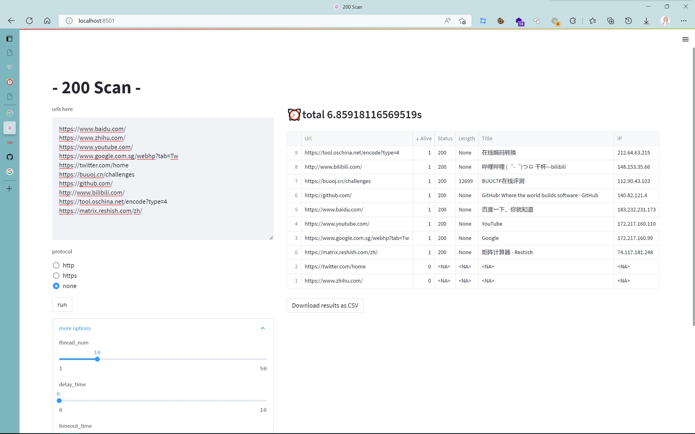

# 200scan

```bash
pip install streamlit==1.12.0
streamlit run .\app\main.py
# localhost:8501
```

批量访问url，探测存活情况并返回简单信息（状态码、大小、标题、实际IP）

支持完整的url或仅ip（可选http或https协议），可自定义访问时的线程数、两次访问的delay_time、单次访问的timeout_time、是否使用代理，扫描结果支持按列排序查看，默认保存结果到同目录下的result.txt中，可选择以CSV格式导出



*页面左右分栏比例（默认1.2: 2）、控件颜色、字体等支持在代码中自行修改，目前导出CSV时在excel中会存在中文乱码问题，尚未解决

*可能会加随机UA，自动补充http/https协议这样的功能？如果有空的话会补上端口协议和banner探测的功能

------

自用99新，代码和功能都比较简单，~~欢迎issue~~（这么简单的轮子也没有issue的必要就是了）

会长期更新捏QwQ
