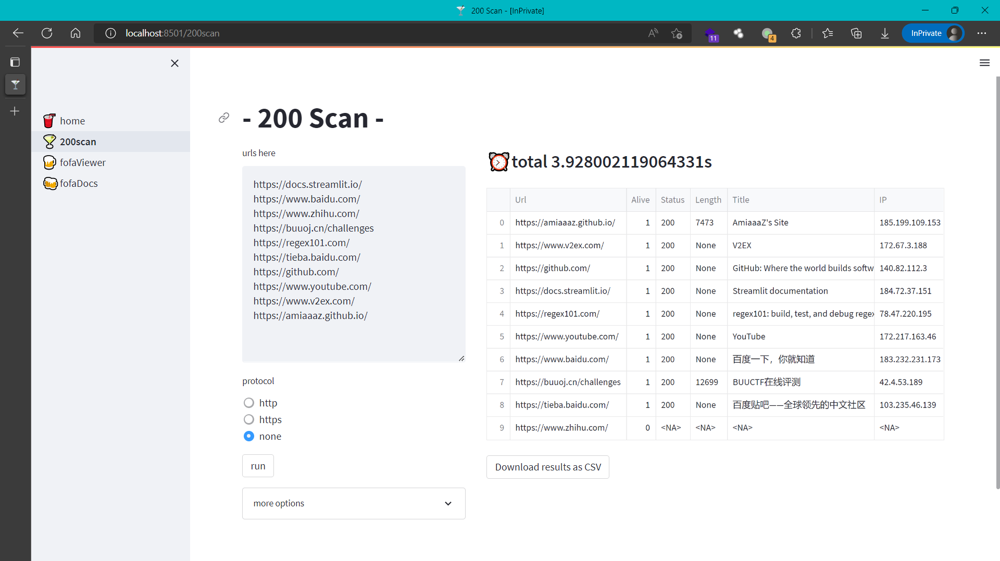
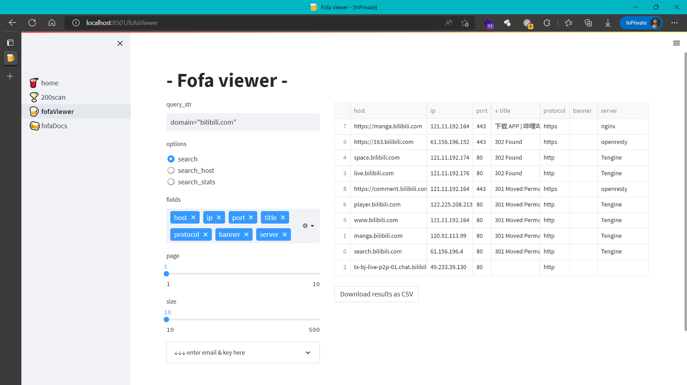

# 200scan

一个~~平平无奇的~~信息收集用工具集！代码和人有一个能跑就行QwQ

```bash
pip install streamlit==1.12.0	# 由streamlit强力驱动
pip install fofa		# 如运行报错参见注1
streamlit run ./app/🥤home.py   # 为美观考虑在文件名中添加了emoji 如运行有问题直接删掉即可
# localhost:8501
```

## 🍸200scan

批量访问url，探测存活情况并返回简单信息

- 支持完整的url或仅ip（可选http或https协议）
- 可自定义访问时的线程数、两次访问的delay_time、单次访问的timeout_time、是否使用代理
- 扫描结果支持按列排序查看
- 结果默认保存到同目录下的result.txt中
- 可选择以CSV格式导出



## 🍺Fofa viewer

调用Fofa API进行查询并返回信息

- 支持自定义各项参数及返回字段
- 查询结果支持按列排序查看
- 可选择以CSV格式导出



*注：页面上所有组件均支持交互www

*注1：如遇fofa库报错，请直接复制[fofa.client](https://github.com/fofapro/fofa-py/blob/master/fofa/client.py)部分代码到fofaViewer.py中！

*注2：页面左右分栏比例（默认1: 2）、字体等支持在代码中自行修改，控件颜色（默认`#359aff`）可直接在右上Menu-Settings-Theme-Edit active theme处直接修改

*注3：目前导出CSV时在excel中预览会存在中文乱码问题（实际编码为UTF-8），此问题尚未解决，使用时请再次单独修改编码TAT

------

自用99新，代码和功能都比较简单，~~欢迎issue~~（这么简单的轮子也没有issue的必要就是了）

会长期更新捏QwQ

------

083122，添加Fofa Viewer

082822，创建仓库，添加200Scan
